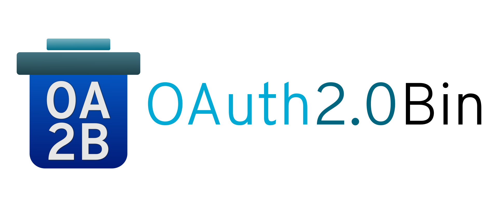

**OAuth 2.0 Bin** is a test server for the OAuth 2.0 Authorization Framework.

# Features
- [RFC 6749](https://tools.ietf.org/html/rfc6749) compliant _(mostly)_
- Persists to Redis
- Uses fixed parameters in requests (`client_id`, `client_secret`)
- Dynamic token generation
- IP-based rate limiting
- Configurable with JSON
- Docker support
- Written in Go
- No dependencies except [redigo](https://github.com/gomodule/redigo)

# Motivation
The motivation behind creating this was the lack of easily accessible OAuth 2.0 servers while testing [Everest](https://github.com/RohitAwate/Everest).

Many services offer the Authorization Code flow, but the other flows such as Implicit Grant, for example, are quite uncommon. Okta does offer a [playground](https://www.oauth.com/playground/) but they deviate from RFC 6749 by requiring a `nonce` parameter in their requests.

There are much more robust servers out there, but I wanted to get my hands dirty and write one myself. This helps me learn and does away with the complexity that a 'real' library/server would bring, which is unnecessary here.

# The Plan
- [x] Support all 4 flows:
  - [x] Authorization Code
  - [x] Implicit
  - [x] Resource Owner Password Credentials
  - [x] Client Credentials
- [x] Responsive layout
- [ ] Ensuring RFC 6749 compliance, except in places where things may be overkill for a test server
- [x] Providing Docker images
- [ ] Deploying to https://oauth2bin.org for everyone to use this as a service _(not yet bought)_

# Standard Installation 
### Pre-requisites
- Go 1.11
- Redis 4

_Older versions may also work, not tested though._

```bash
# Get the repo
go get -u github.com/RohitAwate/OAuth2Bin

# Open the cloned repository
cd $GOPATH/src/github.com/RohitAwate/OAuth2Bin

# Run tests
go test ./...

# Run without building a binary
go run main.go

# Build a binary and run it
go build -o bin/oa2b && bin/oa2b

# Install OAuth2Bin on your system
go install && OAuth2Bin
```

This will use the local Redis server, by default. Optionally, if you want to connect to a remote Redis server, specify the `REDIS_HOST`, `REDIS_PASS` and `REDIS_PORT` environment variables and OA2B will automatically pick them up.

# Docker
Docker Compose is used to run the server and Redis in separate containers. OA2B will automatically use the Redis container for caching.

### Pre-requisites
- Docker 18.09
- Docker Compose 1.17

_Older versions may also work, not tested though._

```bash
# Clone the repo
git clone https://github.com/RohitAwate/OAuth2Bin

# Open the cloned repository
cd OAuth2Bin/

# Build and run the containers
docker-compose up

# Run containers; press Ctrl+C to stop
docker-compose up

# Run containers in the background
docker-compose up -d

# Stop background containers
docker-compose stop
```

# Configuring the server
### Endpoints and Credentials
OA2B uses the `config/flowParams.json` file for configuring the server endpoints and client credentials. It is included in the Git repository. Make the necessary changes before deployment.

It expects separate configurations for every OAuth 2.0 flow in the form of JSON objects. The following parameters are required:

- **Authorization Code**
    - `clientID` Predefined client ID for all requests
    - `clientSecret` Predefined client secret for all requests

- **Implicit Grant**
    - `clientID` Predefined client ID for all requests

- **Resource Owner Password Credentials**
    - `username` Predefined username for all requests
    - `password` Predefined password for all requests
    - `clientID` Predefined client ID for all requests
    - `clientSecret` Predefined client secret for all requests

- **Client Credentials**
    - `clientID` Predefined client ID for all requests
    - `clientSecret` Predefined client secret for all requests

### Rate Limiting
OA2B lets you configure IP-based rate limiting on a per-route basis. The policies must be specified in the `config/ratePolicies.json` file. It is included in the Git repository. Make the necessary changes before deployment.

If a policy is not provided for a certain route, OA2B **does not** impose any default limits and will thus allow all traffic to pass through.

A policy is defined by the following parameters, specified as a JSON object:
- `route` The route to apply the policy to
- `limit` Maximum number of requests permitted within a period
- `minutes` Time period in minutes over which the limit is imposed

#### Example 
```json
{
    "route": "/example",
    "limit": 100,
    "minutes": 30
}

// For the /example route, allow 100 requests per 30 minutes per IP address
```

# License
OAuth 2.0 Bin is licensed under the [Apache 2.0 License](LICENSE).
