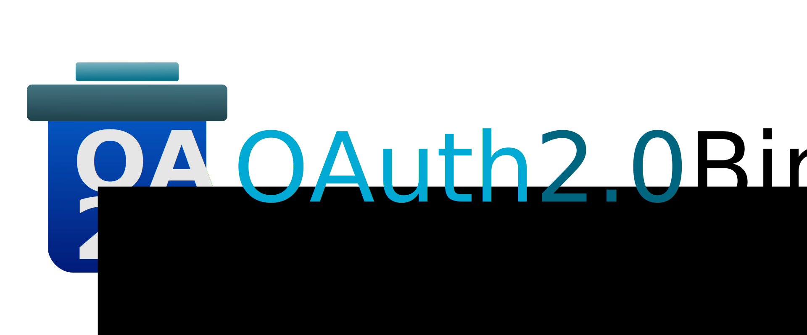

**OAuth 2.0 Bin** is a test server for the OAuth 2.0 Authorization Framework.

# Features
- [RFC 6749](https://tools.ietf.org/html/rfc6749) compliant
- Persists to Redis
- Uses predefined parameters in requests (`client_id`, `client_secret`)
- Dynamic access token generation
- Configurable using a single JSON file
- Written in Go
- No dependencies except [redigo](https://github.com/gomodule/redigo)

# Motivation
The motivation behind creating this was the lack of easily accessible OAuth 2.0 servers while testing [Everest](https://github.com/RohitAwate/Everest).
Many services offer the Authorization Code flow, but the other flows such as Implicit Grant, for example, are quite uncommon. Okta does offer a [playground](https://www.oauth.com/playground/)
but they deviate from RFC 6749 by requiring a `nonce` parameter in their requests.

There are much more robust servers out there, but I wanted to get my hands dirty and write one myself. This helps me learn
and does away with the complexity that a 'real' library/server would bring, which is unnecessary here.

# The Plan
- Support for all 4 flows
  - Authorization Code
  - Implicit
  - Resource Owner Password Credentials
  - Client Credentials
- Responsive layout
- Ensuring RFC 6749 compliance, except in places where some things don't make sense for a test server
- Providing binaries and Docker images
- Deploying to https://oauth2bin.org for everyone to use this as a service _(not yet bought)_

# Building from source
### Build pre-requisites
- Go 1.11
- Redis 4

_Older versions should also work, not tested though._

```bash
# Get the repo
go get -u github.com/RohitAwate/OAuth2Bin

# Open the cloned repo
cd $GOPATH/src/github.com/RohitAwate/OAuth2Bin

# Run without building a binary
go run main.go

# Build a binary and run it
go build -o bin/OA2Bin && bin/OA2Bin

# Install OAuth2Bin on your system
go install && OAuth2Bin
```

# License
OAuth 2.0 Bin is licensed under the [MIT License](LICENSE).
